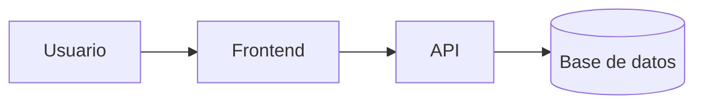

# Sistema de Biblioteca


Sistema de gestión de biblioteca desarrollado como proyecto de práctica.
Permite registrar libros, consultar información y controlar el estado de los préstamos de manera sencilla.

## Tabla de contenidos

* [Descripción](#descripción)
* [Instalación](#instalación)
* [Uso](#uso)
* [Estado de funcionalidades](#estado-de-funcionalidades)
* [Pendientes](#pendientes)
* [Arquitectura](#arquitectura)
* [Contribuidores](#contribuidores)

## Descripción

El Sistema de Biblioteca es una aplicación creada para facilitar la administración de libros y préstamos.

El proyecto permite organizar la información de los libros, registrar usuarios y controlar los préstamos realizados dentro de la biblioteca.

## Instalación

```bash
git clone https://github.com/carlostolentino-svg/laboratorio-readme.git
cd laboratorio-readme
npm install
npm start
```

## Uso

Para utilizar el sistema se deben seguir los siguientes pasos:

```bash
npm start
```

Después de iniciar la aplicación, el usuario puede:

1. Registrar libros.
2. Consultar libros disponibles.
3. Registrar usuarios.
4. Realizar préstamos.
5. Consultar el estado de los préstamos.

## Estado de funcionalidades

| Función              | Estado      |
| -------------------- | ----------- |
| Registro de libros   | Listo       |
| Consulta de libros   | Listo       |
| Registro de usuarios | Listo       |
| Préstamos            | En progreso |
| Reportes             | Pendiente   |

## Pendientes

* [x] Diseño de la base de datos
* [x] Registro de libros
* [x] Registro de usuarios
* [ ] Pruebas unitarias
* [ ] Implementar reportes
* [ ] Mejorar la interfaz
* [ ] Publicar la versión final

## Arquitectura



La arquitectura está formada por un usuario que interactúa con el frontend. El frontend se comunica con la API y la API administra la información almacenada en la base de datos.

## Contribuidores

| Nombre                          | Usuario de GitHub         |
| ------------------------------- | ------------------------- |
| Carlos Fernando Tolentino Lopez | carlostolentino-svg       |

## Conclusión

En este laboratorio se desarrolló un README profesional utilizando diferentes elementos de Markdown avanzado. Se aprendió a utilizar títulos, tablas, listas de tareas, badges, bloques de código y diagramas Mermaid.

La actividad permitió comprender la importancia de documentar correctamente un proyecto en GitHub, ya que el README funciona como la presentación principal del repositorio.
